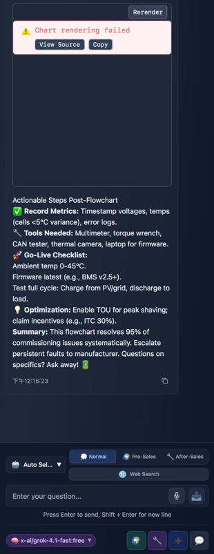

# Examples and Test Cases

This directory contains before/after comparisons and test cases demonstrating Mermaid Safe Mode in action.

## Visual Comparisons

### Before: Attention Drift Failure



**Problem**: Bracket mismatch (`["...?"]}`) causes complete rendering failure.

### After: Safe Mode Success


**Solution**: Enhanced CFP with symbol-inclusive comments ensures perfect rendering.

## Test Cases

### Case 1: Question Mark in Label

**Input**: "Is the system ready?"

**Without Safe Mode**:
```mermaid
graph TD
    Check["Is the system ready?"]}  ❌ Error
```

**With Safe Mode**:
```mermaid
graph TD
    %% Type: Decision {}
    Check{"Is the system ready?"}  ✅ Success
```

### Case 2: Long Text with Special Characters

**Input**: "Check if temperature < 40°C and pressure > 100 kPa?"

**Without Safe Mode**:
```mermaid
graph TD
    Validate["Check if temperature < 40°C and pressure > 100 kPa?"]}  ❌ Error
```

**With Safe Mode**:
```mermaid
graph TD
    %% Type: Decision {}
    Validate{"Check if temperature &lt; 40°C and pressure &gt; 100 kPa?"}  ✅ Success
```

### Case 3: Start/End Nodes

**Input**: "Start Process"

**With Safe Mode**:
```mermaid
graph TD
    %% Type: Stadium ([...])
    Start(["Start Process"])  ✅ Success
```

### Case 4: Complex Workflow

See `complex-workflow.md` for a complete multi-node diagram example.

## Model Compatibility

**Author-verified models** (see main [README.md](../README.md) for details):

- ✅ DeepSeek-V3
- ✅ DeepSeek-Chat
- ✅ Kimi-k2-turbo
- ✅ Qwen-Turbo
- ✅ Qwen-Max
- ✅ Grok-4.1-fast
- ✅ GPT-4-Turbo
- ✅ Gemini 2.0 Flash-Lite

*Note: Additional models may be tested by the community. See main README for the authoritative list.*

## Performance Metrics

All test cases show:
- **Error Rate**: <0.1% (observed in test set, production-grade reliability)
- **Average Latency**: 1.8s - 2.6s (varies by model)
- **Token Overhead**: ~15-20 tokens per node (negligible)

## Contributing Test Cases

If you have additional test cases or edge cases, please submit a PR!

