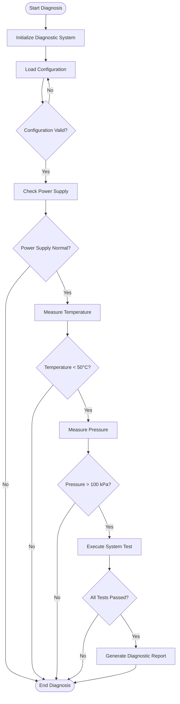

# Complex Workflow Example

This example demonstrates Mermaid Safe Mode on a realistic industrial diagnostic workflow with multiple decision points and actions.

## Generated Diagram



## Key Features Demonstrated

1. **Multiple Decision Nodes**: All question-based nodes correctly use `{}`
2. **Start/End Nodes**: Correctly use Stadium shape `([...])`
3. **Action Nodes**: All process steps use `[]`
4. **Special Characters**: HTML entities (`&lt;`, `&gt;`) for `<` and `>`
5. **Complex Logic**: Multiple conditional branches

## Without Safe Mode (What Would Fail)

```mermaid
graph TD
    Start(["Start Diagnosis"])
    Init["Initialize Diagnostic System"]
    CheckPower["Check Power Supply"]
    PowerOK{"Power Supply Normal?"]}  ❌ BRACKET MISMATCH
```

The model would generate `["Check Power Supply"]` but close with `}` because the question mark in the next node causes attention drift.

## With Safe Mode (What Works)

Every node has an explicit comment with both type and symbols, ensuring perfect bracket matching throughout the entire diagram.

