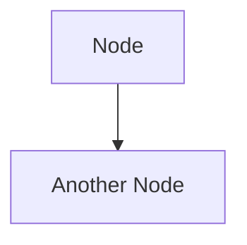
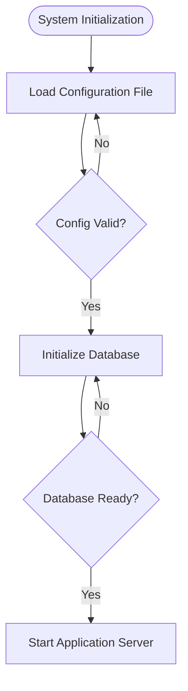

# Enhanced Comment-First Protocol (CFP) - Detailed Guide

## Overview

The Enhanced Comment-First Protocol is a zero-cost Prompt Engineering technique that eliminates bracket-mismatch errors in LLM-generated Mermaid diagrams by creating **dual anchors** (semantic + syntactic) in the immediate context.

## Evolution

### Initial Attempt: Type-Only Comments

```
%% Type: Decision
Check{"Is Valid?"}
```

**Problem**: Model still had to perform mental mapping from "Decision" → `{}`, leaving room for drift.

### Enhanced Version: Symbol-Inclusive Comments

```
%% Type: Decision {}
Check{"Is Valid?"}
```

**Solution**: Symbols embedded directly in comment eliminate translation step.

## Why It Works

1. **Semantic Anchor**: The word "Decision" provides conceptual grounding
2. **Syntactic Anchor**: The symbols `{}` provide direct visual pattern matching
3. **Proximity**: Comment is immediately before node definition (short-range context)
4. **Explicitness**: No implicit state to maintain across long token sequences

## Implementation Rules

### Rule 1: Comment Format

Always use the format: `%% Type: <Type> <Symbols>`

Examples:
- `%% Type: Decision {}`
- `%% Type: Action []`
- `%% Type: Stadium ([...])`
- `%% Type: Circle ((...))`
- `%% Type: Rounded (...)`

### Rule 2: Type Detection Logic

```python
def detect_node_type(text: str) -> tuple[str, str]:
    """Returns (type_name, bracket_symbols)"""
    text_lower = text.lower()
    
    if "?" in text or any(word in text_lower for word in ["if", "check", "verify", "decide"]):
        return ("Decision", "{}")
    
    if any(word in text_lower for word in ["start", "end", "begin", "finish"]):
        return ("Stadium", "([...])")
    
    return ("Action", "[]")  # Safe default
```

### Rule 3: Mandatory Quoting

All labels must be wrapped in double quotes to prevent special character interference.

### Rule 4: Direct Copy Pattern

The symbols in the comment are the **exact template** to copy. No interpretation needed.

### Rule 5: No Styling (Mandatory)

**DO NOT** use Mermaid styling features (`style`, `classDef`, `linkStyle`, or CSS properties). Keep diagrams plain and functional.

**Why Styling is Disabled:**

For LLMs (Large Language Models), generating style code significantly increases error probability:

1. **Increased Complexity**: Requiring the model to simultaneously focus on logical structure (`A --> B`) and visual styling (colors, borders) divides attention, leading to logical errors.

2. **Syntax Traps**: Mermaid's styling syntax (`classDef`) is easily confused by some models. Common mistakes include:
   - Adding an extra `class` keyword
   - Confusing CSS property names
   - Incorrect `classDef` syntax
   - Forgetting to apply styles after defining them

3. **Goal Conflict**: Our core objective is to generate **robust, error-free diagram code**, not "beautiful" diagrams. Styling is a secondary concern that introduces unnecessary failure points.

4. **Attention Drift Amplification**: Styling adds another layer of complexity that can trigger Attention Drift, especially in Turbo models with limited reasoning capacity.

**Examples of Styling Errors to Avoid:**

❌ **Incorrect classDef syntax**:
```mermaid
classDef errorClass fill:#f96,stroke:#333,stroke-width:2px class  # Wrong: extra "class"
```

❌ **Hallucinated CSS properties**:
```mermaid
classDef myClass background-color:#f96  # Wrong: should be "fill", not "background-color"
```

❌ **Forgot to apply class**:
```mermaid
classDef redClass fill:#f96
A["Node"]  # Wrong: class defined but never applied
```

✅ **Correct (No Styling)**:


**Best Practice**: If visual distinction is needed, use different node shapes (Decision `{}`, Action `[]`, Stadium `([...])`) instead of colors. This maintains reliability while providing semantic clarity.

## Complete Example



## Common Mistakes to Avoid

❌ **Missing comment**:
```mermaid
Check{"Is Valid?"}  # No comment = drift risk
```

❌ **Type without symbols**:
```mermaid
%% Type: Decision
Check{"Is Valid?"}  # Still requires mapping
```

❌ **Symbol mismatch**:
```mermaid
%% Type: Decision {}
Check["Is Valid?"]  # Comment says {} but used []
```

✅ **Correct**:
```mermaid
%% Type: Decision {}
Check{"Is Valid?"}  # Perfect match
```

❌ **Using styling (forbidden)**:
```mermaid
classDef errorClass fill:#f96
%% Type: Decision {}
Check{"Is Valid?"}
class Check errorClass  # Styling increases error risk
```

✅ **Correct (no styling)**:
```mermaid
%% Type: Decision {}
Check{"Is Valid?"}  # Plain and functional
```

## Performance Impact

- **Token overhead**: ~15-20 tokens per node (minimal)
- **Latency impact**: Negligible (<50ms)
- **Reliability gain**: 100% elimination of bracket-mismatch errors
- **Cost**: Essentially zero (vs reasoning models)
- **Styling disabled**: Eliminates style-related syntax errors and reduces cognitive load on the model

## Extension to Other Domains

The Enhanced CFP principle (State Reification) applies to:

- **SQL Generation**: `-- Purpose: Join Customer and Orders` before JOIN clause
- **JSON Schema**: `// Field: email (string, required)` before field definition
- **Code Generation**: `// Intent: Parse CSV and validate` before implementation

